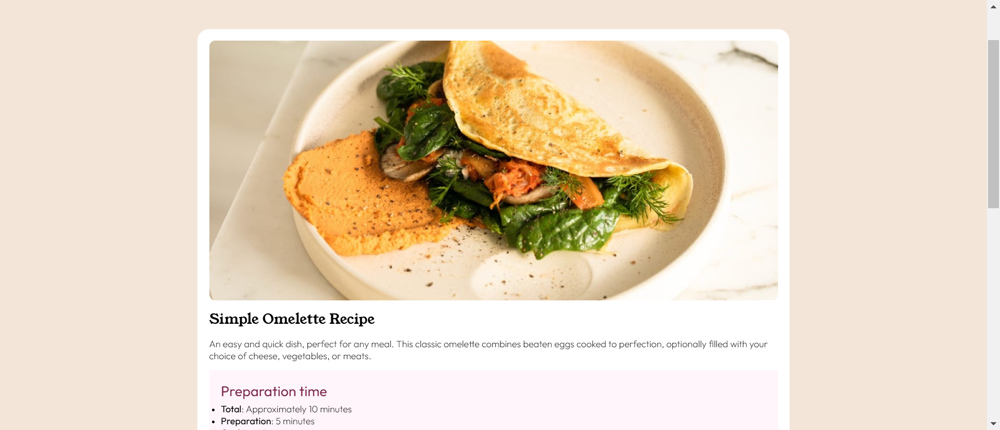
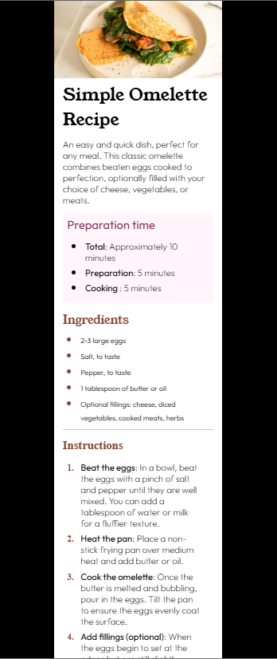

# Frontend Mentor - Recipe page solution

This is a solution to the [Recipe page challenge on Frontend Mentor](https://www.frontendmentor.io/challenges/recipe-page-KiTsR8QQKm). Frontend Mentor challenges help you improve your coding skills by building realistic projects. 

## Overview
The project is a recipe card for a simple omelette. It includes a photo of the finished dish, a list of ingredients, step-by-step instructions, and nutritional information.
### Screenshot




### Links

- Solution URL: [(https://github.com/Ayomide00712/recipe-page-main)]
- Live Site URL: [https://ayomide00712.github.io/recipe-page-main/]

## My process
i started with structuring my html and add CSS to to make it attractive

### Built with

- Semantic HTML5 markup
- CSS custom properties
- Flexbox


### What I learned

```html
<h1>Some HTML code I'm proud of</h1>
```
```css
.proud-of-this-css {
  color: papayawhip;
}
### Continued development
 i want to continue to learn more about responsive design making my websit to fit in any media screen
### Useful resources

## Author

- Website - [ALkassim usman]
- Frontend Mentor - [@Ayomide00712](https://www.frontendmentor.io/profile/Ayomide00712)
- Twitter - [](https://x.com/AyomidePC)


